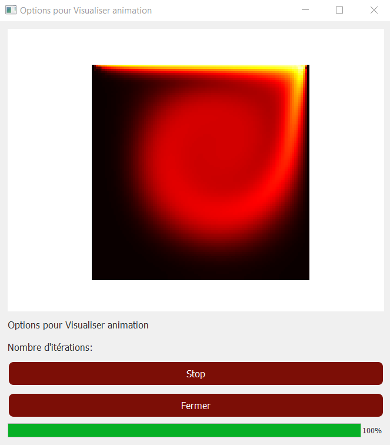
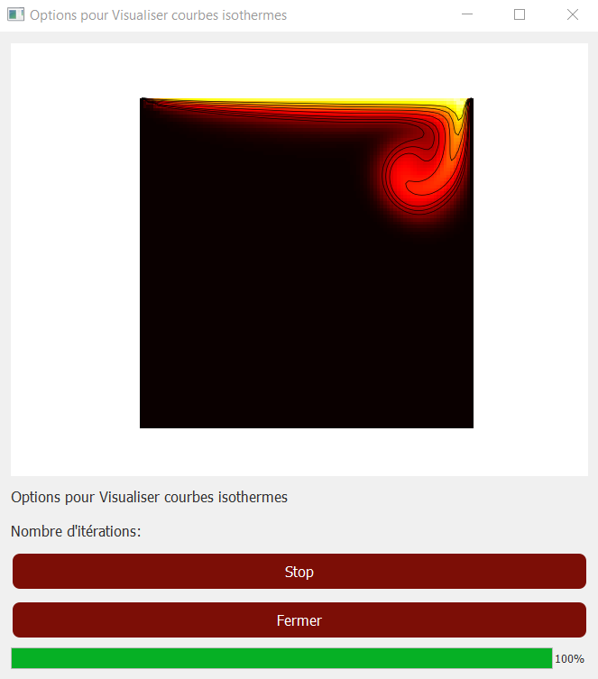
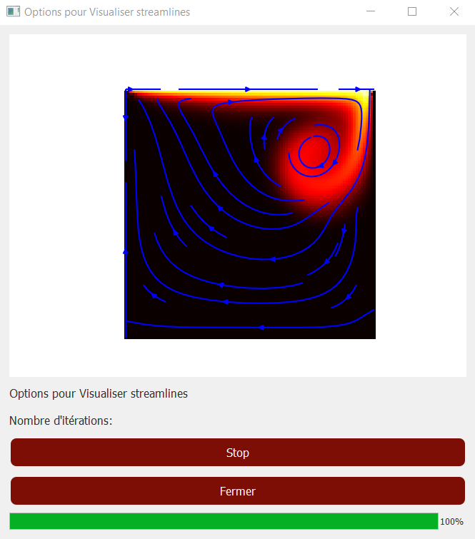

# Cavité Entraînée Chauffée - Simulation LBM 

Ce projet est une application Python pour simuler le **fluide dans une cavité entraînée chauffée** à l'aide de la **méthode Lattice Boltzmann (LBM)**.  
L'application dispose d'une interface graphique interactive pour visualiser les résultats sous forme d'animations, de courbes isothermes et de lignes de courant.

---

## Fonctionnalités principales

- Simulation de convection dans une cavité carrée chauffée avec la méthode **LBM**.  
- Choix des paramètres physiques : viscosité, nombre de Reynolds, Prandtl, diffusion, vitesse du bord supérieur, etc.  
- Visualisation interactive :
  - Animation de la température (χ)  
  - Courbes isothermes avec contours  
  - Streamlines représentant le champ de vitesse  
- Contrôle du nombre d'itérations et de la vitesse de l'animation.  
- Possibilité d'enregistrer les animations au format vidéo `.mp4`.  
- Progression de la simulation affichée via une barre de progression.  

---

## Technologies et bibliothèques

- **Python 3**  
- **PyQt5** pour l'interface graphique  
- **NumPy** pour les calculs numériques  
- **Matplotlib** pour l'affichage et l'animation des résultats  
- **Matplotlib.animation.FuncAnimation** pour l'animation dynamique  
- **FFmpeg** pour l'enregistrement des animations vidéo  

---

## Installation

1. Cloner le dépôt :

```bash
git clone https://github.com/aalexis40/cavite-lbm.git
cd cavite-lbm
```

2. nstaller les dépendances (recommandé dans un environnement virtuel) :

```bash
pip install PyQt5 numpy matplotlib
```

Assurez-vous que FFmpeg est installé sur votre système pour l'export vidéo.

## Utilisation

1. Lancer l'application :
```bash
python main.py
```

2. Interface principale :

Trois boutons principaux pour visualiser :

- Animation de la température
- Courbes isothermes
- Streamlines
- Bouton Quitter pour fermer l'application

3. Interface secondaire :

- Définir le nombre d'itérations de la simulation
- Ajuster la vitesse de l'animation avec le slider
- Cliquer sur Afficher pour démarrer la simulation et l'animation
- Cliquer sur Enregistrer pour sauvegarder l'animation

  ## Paramètres configurables

- **m** : taille du domaine (nombre de cellules)  
- **delta** : pas de grille  
- **tau** : paramètre de relaxation  
- **rho0** : densité initiale  
- **chi0** : température initiale  
- **v0** : vitesse initiale  
- **U0** : vitesse du bord supérieur  
- **nu** : viscosité  
- **Re** : nombre de Reynolds  
- **Pr** : nombre de Prandtl  
- **D** : coefficient de diffusion  

> Ces paramètres sont définis dans `main.py` mais peuvent être modifiés à la volée pour différentes simulations.






